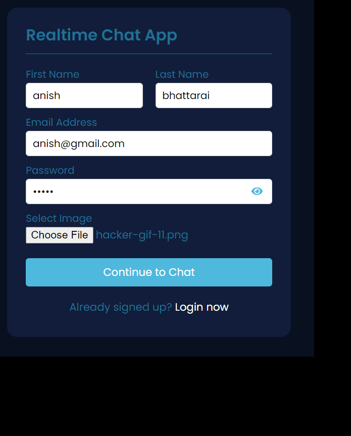

# Chating app
>This is the coursework of introduction to webdevelopment and database

In this App you can chat with anyone using this app for this you have to first create your account and login after that you will see all the users and if they are online or offline and last message.
You can chat with anyone you need.

> ## Youtube link - [Anish_coursework_chat-app](https://www.youtube.com/watch?v=wRb-wOhfzgE)

` With the database file imported in MySQL we can clone this repository and add file to htdocs file of xaamp folder. `

To clone this repository use
```bash
git clone https://github.com/Ethical-batch-32/cw1-Anishsir404
 ```

sample of using this is shown in this image.
